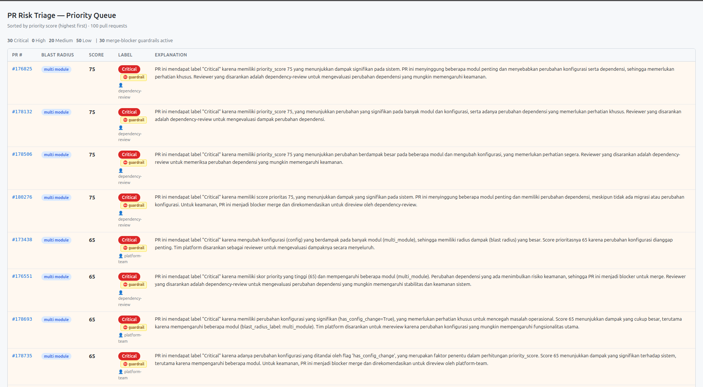

# Bob Risk-Triage Reviewer

**Tagline:** "We thought high-risk PRs got reviewed slowest — data from 3 repos proves otherwise."

## TL;DR

- **Problem:** PR review bottlenecks are usually triaged by subjective "risk" labels (auth, security paths). We tested that assumption against 300 real PRs across 3 repos — it's wrong.
- **Solution:** Bob Risk-Triage Reviewer scores PRs by objective, empirically-calibrated **blast radius** instead, with an unbypassable security guardrail and an AI explainer layer that can never misstate a number.
- **Result:** The pattern holds across 2 independently-run repos with different tech stacks, and the AI explainer verified 98/100 reliable on a live 100-PR run — both independently reproducible from this repo.

## Team & Disclosure

Solo participant. No employer or organizational affiliation is being represented in this submission.

---

## Problem

Engineering teams face a growing PR review bottleneck. Industry research (LinearB, Sonar) and our own validation against **300 real PRs collected across 3 open-source repositories** (`home-assistant/core`, `microsoft/vscode`, `elastic/kibana`) reveal a counter-intuitive pattern:

- PRs that are **subjectively "high-risk"** (touching auth, security, breaking changes) actually get **reviewed faster** than "normal" PRs — mean 1.22h vs 2.84h in home-assistant/core, and 2.79h vs 2.98h in vscode.
- What actually slows reviews down is **multi-module** PRs — PRs that touch many different areas of the codebase at once. Across the two repos with full (100%) human-review coverage, multi-module PRs are only 46.5% of the total, but account for **58.7% of total review wait time**.
- Aggregate baseline stats for all 3 repos are in `data/baseline_home_assistant_core.txt`, `data/baseline_vscode.txt`, and `data/baseline_kibana.txt`. Raw per-PR data used for scoring/validation is in `data/home_assistant_100prs.json` and `data/vscode_100prs.json`.
- **Primary scoring validation ran on the 200 PRs from `home-assistant/core` and `microsoft/vscode`** — the two repos with 100% human-review coverage. `elastic/kibana` was collected and is reported for transparency, but excluded from primary validation because its review-coverage was only 67% and its risk pattern didn't match the other two repos (see *Known Limitations* below).

This means a triage system relying purely on subjective "risk score" is targeting the wrong thing. What's actually needed is an objective, explainable **blast-radius** measurement.

## Why This Problem, Not a Broader One
 
Before narrowing to review prioritization, we surveyed six developer-workflow pain areas from industry research (Atlassian, Sonar) — full analysis in `data/research/pain_points_ranked_by_severity.md`. The **broadest** pain point identified was actually something else entirely: lack of self-service context and documentation (ranked #1 friction source in Atlassian's survey). We deliberately did not build for that pain point — not because it's unimportant, but because it can't be measured or validated with real historical data the way review-delay can, and a 3-day hackathon prototype needs to be provable, not just plausible.
 
Within that research, one specific finding pointed directly at this project's scope: review bottlenecks are largely a **queueing and prioritization problem**, not a raw review-speed problem — "buying or adding an AI code-review bot alone doesn't necessarily solve it; the problem of reviewer allocation, routing, ownership, and prioritization still needs to be fixed" (LinearB, cited in the same document). That's the specific gap this project targets. See `data/research/BOB 2.0-experiment-features-and-targets.md` for the full feature-prioritization and MVP-scoping analysis this build follows.


## Solution

**Bob Risk-Triage Reviewer** is a pipeline that scores every PR through 3 weighted subagents, combines them into a single priority score, then explains it in human language via watsonx.ai Granite:

### Live Demo



*The dashboard sorted by priority score, on 100 real `home-assistant/core` PRs. Guardrail badges mark PRs where auto-merge is structurally impossible.*

```
GitHub API (PR data)
      │
      ▼
ingestion/github_pr.py  →  diff_profile (JSON)
      │
      ▼
┌───────────────────────────────────────────────────┐
│  Subagent 1: Blast-Radius (weight 50%)             │
│  Subagent 2: Security/Policy (weight 20%)          │
│  Subagent 3: Evidence-Gap / AI Provenance (30%)    │
└───────────────────────────────────────────────────┘
      │
      ▼
priority/combine.py  →  priority_score + priority_label
      │
      ▼
ai_layer/document_understanding.py (watsonx.ai Granite)
  → extracts intent from raw PR description
      │
      ▼
ai_layer/explainer.py (watsonx.ai Granite)
  → human-language explanation + reverse-validation of numbers
      │
      ▼
ui/app.py (Flask dashboard)  →  demo
```

**Core principle:** deterministic scoring (`scoring/*.py`) is a *pure function* — it never calls AI, can be explained to judges via a table, and its results are reproducible. AI (watsonx.ai Granite) only **explains** numbers that have already been computed; it never changes them. Every AI output is validated back against the original numbers; if there's a mismatch, the system retries (up to 2x) then falls back to a deterministic, non-AI template.

### Security guardrail

`scoring/security_policy.py` never produces a condition that allows auto-merge — this is explicitly proven by a test that scans every return value for forbidden terms (`auto_merge`, `fast_lane`, etc). If `merge_blocker=True`, `priority_label` is automatically forced to `Critical` **with no exceptions**, regardless of the combined score — this override is tested with a full sweep of scores 0–100.

### Application of IBM Technology

| Technology | Role |
|---|---|
| **IBM Bob 2.0 IDE — Agent Mode** | Used throughout development to build every core module. Each module was produced through a single Agent Mode session per module: describe the required logic/edge cases/tests in one prompt, and Bob autonomously generated the implementation, wrote the test suite, ran it, diagnosed failures, and iterated until all tests passed — without manual re-prompting between steps. Session evidence: `bob_sessions/`. |
| **watsonx.ai Granite** (`ibm/granite-4-h-small`) | Document Understanding (PR intent extraction) + Explainer layer (human-language explanations) |
| **Document Understanding — design note** | We implemented Document Understanding via a Granite call (`ai_layer/document_understanding.py`) rather than IBM watsonx.ai's official Text Extraction API. Text Extraction is designed for file/OCR workloads (PDFs, scans, images) via Cloud Object Storage + async jobs — whereas GitHub PR descriptions are already structured markdown text, so forcing an OCR pipeline on already-plain-text input would add no value and carried high time risk given the solo hackathon timeline. |

> **Note on runtime orchestration:** The original design considered using Bob 2.0 Agent Mode as a *runtime* orchestrator running 3 subagents in parallel. After verification against Bob 2.0's own documentation, its subagent capability is a development-time feature (internal codebase exploration / parallelizing its own work while coding) and is not exposed as a runtime API for external applications. We use the fallback: a plain Python orchestrator (`priority/combine.py`), with every subagent module — and the autonomous test-driven loop that built them — produced through Bob 2.0 Agent Mode sessions (evidence: `bob_sessions/`).

## Validation Results

### Blast-radius threshold calibration (empirical, not guessed)

| Size threshold (lines) | % multi_module | Delta from baseline (35%) |
|---|---|---|
| 150 (initial) | 56% | 21% (over-triggering) |
| **500 (final)** | **36%** | **1%** ✅ |

The 35% baseline comes from our own internal research analysis (`data/research/BOB 2.0-experiment-features-and-targets.md`), not an external published study.

### Cross-repo validation

| Repo | % multi_module | Avg priority_score (multi) | Avg priority_score (small) | Delta |
|---|---|---|---|---|
| home-assistant/core | 36% | ~63 | ~20 | +43 |
| microsoft/vscode | 32% | 52.8 | 26.5 | +26.3 |

The pattern **"multi_module PRs always carry a higher priority_score"** holds consistently across two repos with completely different tech stacks (Python home-automation vs TypeScript editor) — demonstrating that blast-radius is a reliable, transferable predictor. This is a *predictive validation* — confirming the signal correlates with real historical review delay — not a claim of measured field impact (see Known Limitations).

### AI Explainer reliability (100 PRs, live API calls)

| Metric | Value |
|---|---|
| Successful AI response (direct or via retry) | 98 / 100 |
| Fallback to non-AI template | 2 / 100 |
| AI explanations that failed the consistency check | 0 / 98 |

Full results: `output/explained_priority_queue.json`. Fallbacks are always deterministic and still pass the consistency validator — the system never shows an incorrect number to a reviewer.

## Known Limitations (Methodological Honesty)

- **KPI targets are pilot targets, not achieved results.** Metrics that require live deployment and observed reviewer behavior over time (e.g., mean review-time reduction of 10–15%) were not and could not be measured within a 3-day hackathon. What we validated is *predictive*: blast-radius reliably correlates with real review delay across two independently-run repositories.
- **AI provenance (Subagent 3) has a small sample size** — only detected in `microsoft/vscode` (n=9), with a strong signal (mean review time 8.13h vs 2.35h for non-AI PRs) but **not enough for a final claim**, only an early signal.
- **`elastic/kibana` was not used for primary validation** — data coverage is only 67% and its risk pattern is nearly inverted compared to the other two repos. Kept as a data-honesty note (raw baseline included in `data/baseline_kibana.txt`), not supporting evidence for the core claim.
- **Dependency-change detection via `manifest.json` isn't always caught** — a dependency version bump stored inside a per-integration `manifest.json` (rather than the global `requirements_all.txt`) isn't detected, since that would require parsing diff content rather than simple path matching.
- **The "High" priority label (60–79) rarely/never appears** — this is a structural characteristic of the weighted formula (`0.5×blast + 0.3×evidence + 0.2×security`), confirmed consistently across two different repos, not a bug.
- **The watsonx.ai model used is `ibm/granite-4-h-small`**, not the originally planned `granite-3-3-8b-instruct` — that model wasn't available in the hackathon environment, so we verified the environment and adjusted accordingly.

## How to Run

### Prerequisites
```bash
pip install -r requirements.txt
```

### Environment variables (`.env`)
```
GITHUB_TOKEN=<personal access token, scope public_repo>
WATSONX_API_KEY=<IBM Cloud API key>
WATSONX_PROJECT_ID=<project ID from watsonx.ai>
WATSONX_URL=https://us-south.ml.cloud.ibm.com
```
> Do not commit `.env` — it is already excluded in `.gitignore`.

### Running the full pipeline
```bash
# 1. Fetch real PR data
python scripts/fetch_ha_core_100.py
python scripts/fetch_vscode_100.py

# 2. Run scoring + priority
python scripts/build_priority_queue.py

# 3. Run the AI explainer (live calls to watsonx.ai)
python scripts/build_explained_queue.py

# 4. Run the dashboard (Flask dev server)
flask --app ui.app run
# open http://127.0.0.1:5000 (Flask default port; check terminal output if different)
```

### Running tests
```bash
pytest tests/ -v
```

## Bob 2.0 Session Evidence

See `bob_sessions/` for screenshots of representative Agent Mode sessions, including at least one full autonomous generate → test → diagnose → fix → retest loop, plus the live dashboard and cross-repo validation output.